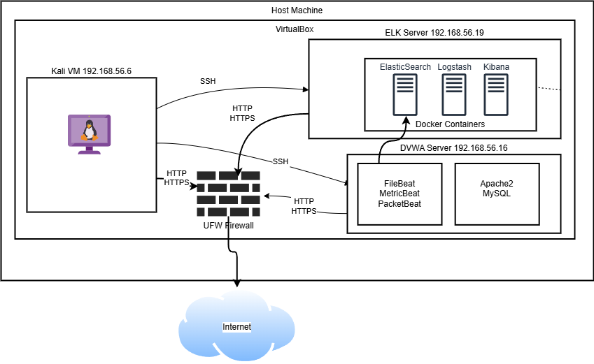
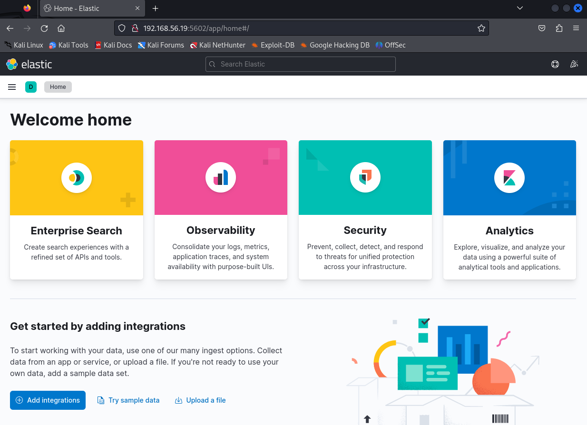

# CyberSec-Lab
# Cybersecurity Home Lab with ELK Stack and DVWA

## Table of Contents
1. [Project Overview](#project-overview)
2. [Features](#features)
3. [Architecture](#architecture)
4. [Installation and Setup](#installation-and-setup)
   - [Step 1: Set Up ELK Stack VM](#step-1-set-up-elk-stack-vm)
   - [Step 2: Set Up DVWA VM](#step-2-set-up-dvwa-vm)
   - [Step 3: Configure Kibana Dashboards](#step-3-configure-kibana-dashboards)
---

## Project Overview
This project provides a **cybersecurity home lab** environment for learning and testing blue team and red team security concepts. It combines an ELK stack for log management and visualization with DVWA (Damn Vulnerable Web Application) for penetration testing.

Key goals include:
- Collecting and visualizing logs from a vulnerable web application.
- Simulating cyberattacks for analysis and defense.

---

## Features
- **Centralized Log Management:** ELK stack collects and indexes logs from all components.
- **Attack Simulation:** Use DVWA as a target for penetration testing.
- **Log Forwarding:** Filebeat, Metricbeat, and Packetbeat send logs and metrics to Elasticsearch.
- **Visualization:** Custom Kibana dashboards for monitoring and analysis.

---

## Architecture

| VM Name       | OS             | Role                                                                  |
|---------------|----------------|-----------------------------------------------------------------------|
| **ELK Stack** | Ubuntu Server  | Hosts ELK stack components and receives logs from Beats.              |
| **DVWA**      | Ubuntu Server  | Runs a vulnerable web application and sends logs to the ELK stack.    |
| **Kali VM**   | Kali Linux     | Acts as the penetration testing platform.                            |

### 1. DVWA-Vuln VM
- This machine runs a vulnerable application, DVWA, specifically designed for penetration testing and log creation. Logs generated by this VM are forwarded to the ELK stack using Filebeat.

### 2. ELK VM
- This VM hosts the ELK stack components:
    - **Elasticsearch:** Stores logs.
    - **Logstash:** Processes and enriches logs.
    - **Kibana:** Visualizes logs.
    - Hosts Python scripts for:
        - **Threat enrichment** with Abuse IPDB.
        - **Log analysis** with ChatGPT.
        - **Automated responses** using scripts.

### 3. Kali VM
- This central management server is used to configure the other machines and test the DVWA-Vuln machine. It generates logs and performs various security assessments

### Network Setup
- **Internal Network (10.0.2.0/24):** All VMs are connected to a private network for secure communication.
- **NAT Adapter:(192.168.56.0/24)** Provides internet access for downloading dependencies. Only necessary ports are exposed to the NAT network using UFW.



---

## Installation and Setup
### Prerequisites
- **VirtualBox** installed.
- **Ubuntu Server** - [Ubuntu Server](https://ubuntu.com/download/server)
- **Kali Linux** - [Kali Linux](https://www.kali.org/get-kali/#kali-virtual-machines)

### VM Configuration
1. **Resources**:
   - ELK: 4 Cores, 8GB RAM, 100GB Storage.
   - DVWA: 2 Cores, 2GB RAM, 25GB Storage.
   - Kali-VM: 2 Cores, 2GB RAM, 25GB Storage.

2. **Network**:
   - Adapter 1: NAT (Internet).
   - Adapter 2: Internal network (`network-name`).

### Environment Setup

1. **Configure SSH on both Ubuntu Servers and Kali VM, then Login to each server**

   **Ubuntu**:
      - [Ubuntu Setup](docs/Ubuntu-Setup.md)

   **Kali**:
      - [Kali SSH Setup](docs/Kali-SSH-Setup.md)
- On Kali machine, SSH into each server.
    ```bash 
    ssh <username>@<IP_of_ELK_VM>
    ssh <username>@<IP_of_DVWA_VM>

---

### Step 1: Set Up ELK VM

1. Setup the ELK VM:
- [ELK Machine Setup](ELK/README.md): Instructions for configuring Elasticsearch, Logstash, and Kibana.

2. Verify functionality:
    ```bash
    docker-compose up -d

- Access:`http://<ELK_VM_IP>:5602`


3. Turn off containers: 
    ```bash
    docker-compose down

### Step 2: Set Up DVWA-Vuln VM

1. Setup DVWA-Vuln VM:
- [DVWA Machine Setup](DVWA/README.md): Instructions for configuring DVWA, MySQL, Apache, Filebeat, Packetbeat, Metricbeat.

2. Verify Functionality:
- Access: `http://<DVWA-IP>/dvwa`
- Test Beats outputs
    ```bash
    sudo filebeat test output
    sudo metricbeat test output
    sudo packetbeat test output

### Step 3: Configure Kibana Dashboards
1. Access Kibana:
   - Open your web browser and navigate to your Kibana instance (e.g., `http://localhost:5602`).

2. Load Dashboards:
   - Since you've already configured Metricbeat, Filebeat, and Packetbeat to load dashboards via the Kibana API, the dashboards should be available in Kibana. You can verify this by navigating to the **Dashboard** section in Kibana.

3. Explore Dashboards:
   - Go to **Dashboard** in the left-hand menu.
   - Use the search bar to find the pre-built dashboards for Metricbeat, Filebeat, and Packetbeat. These dashboards provide visualizations and insights based on the data collected by each beat.

4. Create Custom Visualizations:
   - If you want to create custom visualizations, go to **Visualize** in the left-hand menu.
   - Click on **Create visualization** and choose the type of visualization you want (e.g., bar chart, line chart, pie chart).
   - Select the index pattern that corresponds to the data you want to visualize (e.g., `metricbeat-*`, `filebeat-*`, `packetbeat-*`).
   - Configure your visualization by selecting the appropriate fields and metrics.

5. Build Custom Dashboards:
   - To create a custom dashboard, go to **Dashboard** and click on **Create dashboard**.
   - Add your custom visualizations by clicking on **Add** and selecting the visualizations you created.
   - Arrange and resize the visualizations as needed to create a cohesive dashboard.

6. Save and Share Dashboards:
   - Once you're satisfied with your dashboard, click on **Save** to save it.
   - You can share your dashboard with others by clicking on **Share** and generating a link or embedding the dashboard in another application.